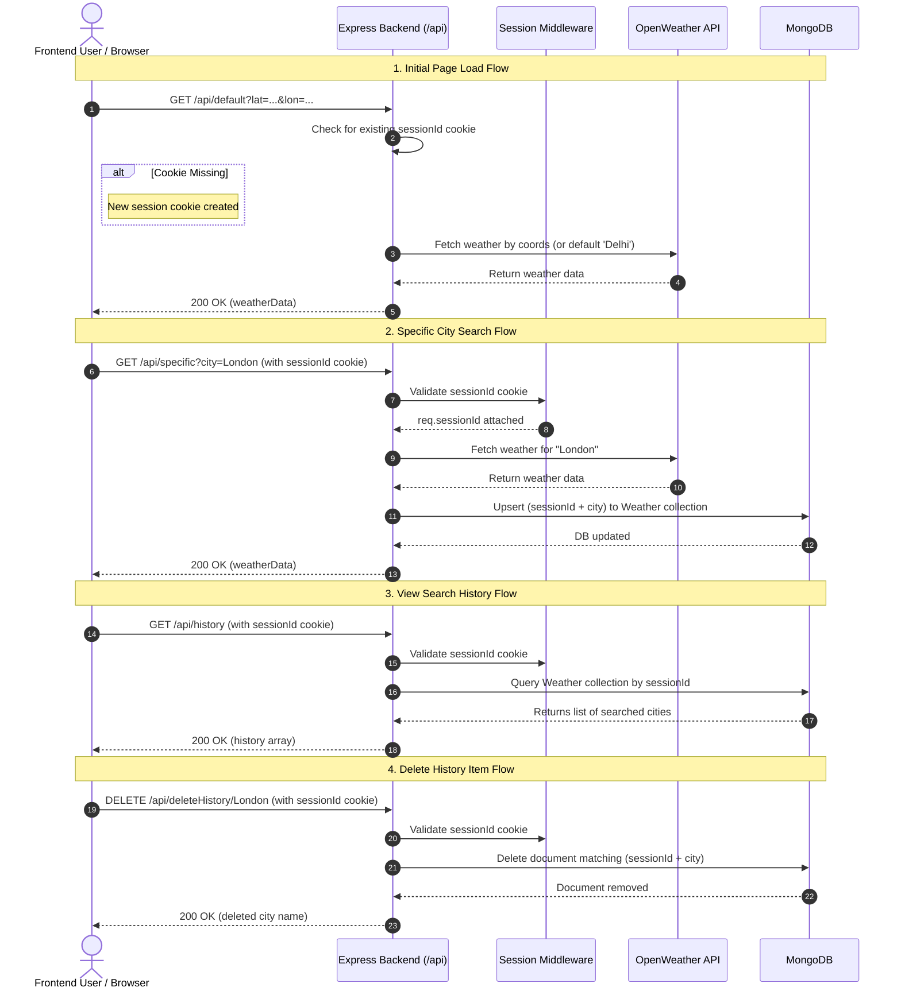

# Weather Application - Backend API Architecture

## 📌 Architecture Overview

This backend is specifically designed as a **BFF (Backend-for-Frontend) service** tailored for a Web Weather Dashboard. Its architecture bridges the frontend user interface with the external OpenWeatherMap API and MongoDB database while maintaining a seamless, zero-login user experience.

---

## 🚀 Why This Architecture is Suitable for Frontend-First Applications

### 1. Anonymous Session Management (No Authentication Required)
- Traditional APIs require users to log in with an email and password to track user-specific state.
- This backend uses an **anonymous, persistent cookie-based session system** (`sessionId`).
- When the frontend app first initializes, it hits the `/api/default` route. The server checks for a `sessionId` cookie; if absent, it issues a long-lived, `HttpOnly`, `sameSite: lax` cookie valid for 30 days.
- Subsequent frontend requests automatically include this cookie via CORS `credentials: true`, keeping search history tied to the specific browser without burdening the user with account creation.

### 2. Zero API Key Exposure
- The OpenWeatherMap API key (`WEATHER_API`) remains securely hidden in backend environment variables (`.env`).
- The frontend never makes direct calls to third-party weather APIs, preventing quota theft and API key leakage.

### 3. Graceful Fallbacks & High Availability
- If the external weather API fails or quota limits are exceeded, the backend returns pre-configured default/mock data (`exampleData`) instead of crashing the frontend UI.
- The frontend always receives a consistent JSON response structure regardless of external API availability.

---

## 🔄 End-to-End User & Request Lifecycle Flow



---

## 📁 Directory Structure & Responsibilities

```
backend/
├── api/
│   ├── deleteHistory.js        # DELETE /api/deleteHistory/:city - Removes history item
│   ├── getDefaultWeather.js    # GET /api/default - Issues session & fetches default/coords weather
│   ├── getHistory.js          # GET /api/history - Returns search history for current session
│   ├── getSpecificWeather.js  # GET /api/specific - Fetches city weather & saves search to DB
│   ├── index.api.js            # Router aggregator for all API endpoints
│   └── samples/
│       └── data.js             # Fallback mock weather data for API downtime
├── controller/
│   ├── session.controller.js   # Middleware enforcing valid session cookies
│   └── validation.js           # Zod schemas for query/param inputs
├── model/
│   └── weatherSchema.js        # Mongoose schema for user search history
├── app.js                      # Express configuration, CORS & middleware setup
├── db.js                       # MongoDB connection initializer
├── server.js                   # Application entry point & HTTP listener
└── package.json                # Dependencies & npm scripts
```

---

## ⚙️ Environment Variables Setup

Create a `.env` file in the `backend/` root directory:

```env
PORT=3000
MONGO_URI=mongodb+srv://<username>:<password>@cluster.mongodb.net/weatherApp
WEATHER_API=your_openweathermap_api_key
FRONTEND_URL=http://localhost:5173
```

---

## 🛠️ API Endpoints Summary

| Endpoint | Method | Middleware | Description |
| :--- | :--- | :--- | :--- |
| `/api/default` | `GET` | Optional query (`lat`, `lon`) | Initializes `sessionId` cookie & returns default/geo weather. |
| `/api/specific` | `GET` | `session` (req.cookies) | Validates city name, fetches weather, and records history. |
| `/api/history` | `GET` | `session` (req.cookies) | Returns list of previously searched cities for the session. |
| `/api/deleteHistory/:city` | `DELETE` | `session` (req.cookies) | Deletes a specific city entry from session history. |
