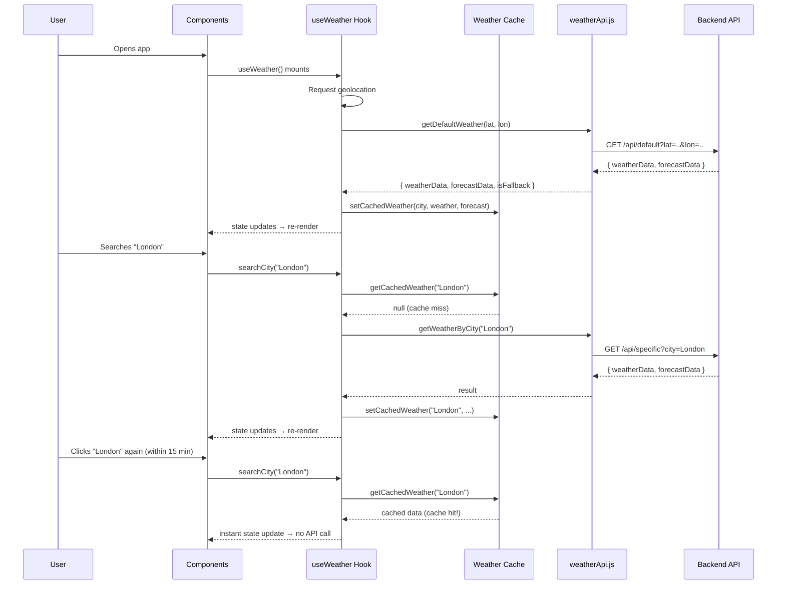

# Weather Dashboard — Frontend

A modern, polished React weather dashboard that consumes an Express + MongoDB backend. The frontend is purely presentational — it never calls the OpenWeatherMap API directly. All weather/forecast data, search history, and session management is handled by the backend.

---

## Table of Contents

- [Architecture Overview](#architecture-overview)
- [Data Flow Diagram](#data-flow-diagram)
- [Project Structure](#project-structure)
- [File Reference](#file-reference)
- [Core Layers](#core-layers)
  - [API Service Layer](#api-service-layer-weatherapijs)
  - [State Management Hook](#state-management-hook-useweatherjs)
  - [In-Memory Weather Cache](#in-memory-weather-cache)
- [Component Breakdown](#component-breakdown)
- [Data & State Flows](#data--state-flows)
  - [Initial Load Flow](#1-initial-load-flow)
  - [City Search Flow](#2-city-search-flow)
  - [Cache Hit Flow](#3-cache-hit-flow)
  - [Delete History Flow](#4-delete-history-flow)
  - [Forecast Day Selection](#5-forecast-day-selection)
- [UI States](#ui-states)
- [Cookie & Session Handling](#cookie--session-handling)
- [Geolocation Flow](#geolocation-flow)
- [Responsive Design](#responsive-design)
- [Accessibility](#accessibility)
- [Security](#security)
- [Design Decisions](#design-decisions)
- [Tech Stack](#tech-stack)

---

## Architecture Overview

```
┌────────────────────────────────────────────────────────────┐
│                        Browser                             │
│                                                            │
│  ┌──────────┐   ┌──────────────┐   ┌────────────────────┐ │
│  │  App.jsx  │──▶│ useWeather() │──▶│  weatherApi.js     │─┼──▶ Backend API
│  │ (layout)  │   │  (all state) │   │  (axios + cookies) │ │    (Express)
│  └──────────┘   └──────────────┘   └────────────────────┘ │
│       │                │                     │             │
│       │                │              ┌──────▼──────┐      │
│       │                │              │weatherCache │      │
│       │                │              │  (in-memory)│      │
│       ▼                ▼              └─────────────┘      │
│  ┌─────────────────────────────┐                           │
│  │  Components (presentational) │                          │
│  │  Header, SearchBar, Hero,    │                          │
│  │  Stats, Forecast, History,   │                          │
│  │  Loading, Error, Empty,      │                          │
│  │  ConfirmModal                │                          │
│  └─────────────────────────────┘                           │
└────────────────────────────────────────────────────────────┘
```

**Key principle**: Components are purely presentational. All API calls, state management, and business logic live in `useWeather()` and `weatherApi.js`. Components receive data and callbacks as props.

---

## Data Flow Diagram



---

## Project Structure

```
frontend/weatherDashBoard/
├── .env                          # VITE_API_URL (backend URL)
├── index.html                    # HTML shell, fonts, meta
├── package.json                  # Dependencies
├── src/
│   ├── main.jsx                  # React entry point
│   ├── index.css                 # Global design tokens, reset, animations
│   ├── App.jsx                   # Root orchestrator
│   ├── App.css                   # App-level layout
│   ├── services/
│   │   └── weatherApi.js         # Axios client, all API functions
│   ├── hooks/
│   │   └── useWeather.js         # Central state management hook
│   ├── utils/
│   │   ├── formatWeather.js      # Temperature, visibility, date formatters
│   │   ├── weatherIcons.js       # Icon URL builder + emoji fallback mapper
│   │   └── weatherCache.js       # In-memory weather/forecast cache
│   └── components/
│       ├── Header.jsx + .css     # App header with branding + location
│       ├── SearchBar.jsx + .css  # City search input + submit
│       ├── WeatherHero.jsx + .css# Main weather display (city, temp, icon)
│       ├── WeatherStats.jsx + .css# 4-card stat grid (humidity, wind, etc.)
│       ├── Forecast.jsx + .css   # Temperature chart + daily forecast row
│       ├── SearchHistory.jsx+.css# History chips with click + delete
│       ├── ConfirmModal.jsx + .css# Delete confirmation dialog
│       ├── LoadingState.jsx + .css# Full-page shimmer skeleton
│       ├── ErrorState.jsx + .css # Context-aware error display
│       └── EmptyState.jsx + .css # "No recent searches" placeholder
```

---

## File Reference

### Configuration & Entry

| File | Purpose |
|---|---|
| `.env` | `VITE_API_URL=http://localhost:3000` — backend URL. Never contains API keys. |
| `index.html` | HTML shell with Inter font (Google Fonts), viewport meta, description meta. |
| `main.jsx` | React 19 entry point. Renders `<App />` inside `<StrictMode>`. |
| `index.css` | Global CSS: design tokens (colors, spacing, typography, radii), CSS reset, `fadeIn`/`slideUp`/`shimmer` keyframe animations, `.container` utility, `.skeleton` class. |

### Services

| File | Purpose |
|---|---|
| `weatherApi.js` | Centralized Axios instance with `withCredentials: true`. Exports 4 async functions that map 1:1 to backend endpoints. Transforms raw Axios errors into user-friendly error messages. |

### Hooks

| File | Purpose |
|---|---|
| `useWeather.js` | The single source of truth for all weather state. Manages: `weather`, `forecast`, `loading`, `searchLoading`, `error`, `isFallback`, `history`, `historyLoading`. Exposes: `searchCity()`, `deleteHistory()`, `refreshHistory()`. Handles geolocation, cache reads/writes, and history refresh after searches. |

### Utilities

| File | Purpose |
|---|---|
| `formatWeather.js` | `formatTemp()` — rounds temp + appends °. `formatVisibility()` — converts meters to km. `formatDate()` — unix timestamp to "Sunday, Sep 21". `formatTime()` — current time string. `capitalizeWords()` — "clear sky" → "Clear Sky". |
| `weatherIcons.js` | `getWeatherIconUrl(iconCode)` — constructs OpenWeatherMap icon URL (`@4x`). `getWeatherEmoji(conditionMain)` — maps weather condition to emoji fallback. |
| `weatherCache.js` | In-memory `Map`-based cache. Key: normalized city name (lowercase + trimmed). Value: `{ weatherData, forecastData, timestamp }`. TTL: 15 minutes. Exports: `getCachedWeather()`, `setCachedWeather()`, `invalidateCache()`, `clearCache()`. |

### Components

| Component | Purpose | Props |
|---|---|---|
| `Header` | Sticky header with CloudSun icon branding + location pill showing current city | `cityName` |
| `SearchBar` | Pill-shaped form with search icon, text input, submit button. Spinner on loading. | `onSearch`, `isLoading` |
| `WeatherHero` | Main weather card: city name, country, date, temperature (gradient text), description, feels-like, hi/lo, weather icon | `weather`, `isFallback` |
| `WeatherStats` | 4-card responsive grid: humidity, wind speed, pressure, visibility. Only renders stats that exist in the data. | `weather` |
| `Forecast` | SVG temperature line chart (Catmull-Rom smooth curves) + hourly time labels + clickable daily forecast row. Manages `selectedDateKey` state internally. | `forecastData` |
| `SearchHistory` | Renders history as pill chips. Click chip → search that city. Click × → opens confirmation modal. Shows skeleton while loading, EmptyState when empty. | `history`, `historyLoading`, `onSelect`, `onDelete` |
| `ConfirmModal` | Reusable confirmation dialog with backdrop blur, slide animations (open + close), Escape/backdrop dismiss. Keyboard accessible. | `isOpen`, `title`, `message`, `onConfirm`, `onCancel` |
| `LoadingState` | Full-page shimmer skeleton matching the layout of Hero + Stats + History sections | (none) |
| `ErrorState` | Context-aware error card. Maps error strings to specific icons (SearchX for 404, WifiOff for network, CloudOff for generic). Optional retry button. | `error`, `onRetry` |
| `EmptyState` | "No recent searches yet" placeholder with Clock icon | (none) |

---

## Core Layers

### API Service Layer (`weatherApi.js`)

A single Axios instance configured once:

```js
const api = axios.create({
  baseURL: import.meta.env.VITE_API_URL || "http://localhost:3000",
  withCredentials: true,  // sends session cookie with every request
  timeout: 15000,
});
```

**Exported functions:**

| Function | Endpoint | Returns |
|---|---|---|
| `getDefaultWeather(lat, lon)` | `GET /api/default[?lat=..&lon=..]` | `{ weatherData, forecastData, isFallback }` |
| `getWeatherByCity(city)` | `GET /api/specific?city=..` | `{ weatherData, forecastData, isFallback }` |
| `getHistory()` | `GET /api/history` | `Array<{ city, country, searchedAt }>` |
| `deleteHistoryItem(city)` | `DELETE /api/deleteHistory/:city` | `{ success, message }` |

**Error handling**: The private `handleError()` function transforms raw Axios errors into clean `Error` objects with user-friendly messages. For 503 responses, it attaches `fallbackData` and `fallbackForecast` properties so the caller can display fallback weather data.

**Security**: City names are passed via Axios `params` (auto-encoded). Delete uses `encodeURIComponent()` for the URL path segment. No API keys exist in frontend code.

---

### State Management Hook (`useWeather.js`)

The `useWeather()` hook is the **single source of truth** for the entire dashboard. All API calls and state transitions go through this hook.

**State variables:**

| State | Type | Purpose |
|---|---|---|
| `weather` | `object \| null` | Current weather data from the backend |
| `forecast` | `object \| null` | 5-day/3-hour forecast data |
| `loading` | `boolean` | `true` during initial page load |
| `searchLoading` | `boolean` | `true` during a city search API call |
| `error` | `string \| null` | Current error message, if any |
| `isFallback` | `boolean` | `true` when displaying fallback/mock data |
| `history` | `array` | Search history items from MongoDB |
| `historyLoading` | `boolean` | `true` while fetching history |

**Exposed callbacks:**

| Callback | Purpose |
|---|---|
| `searchCity(city)` | Checks cache → if hit, updates state instantly. If miss, calls backend, caches result, refreshes history. |
| `deleteHistory(city)` | Optimistic UI removal → backend DELETE → invalidates cache. Reverts on failure. |
| `refreshHistory()` | Re-fetches history from backend. |

**Initialization** (`useEffect` on mount):
1. Requests geolocation (8s timeout, 5min cache)
2. Calls `getDefaultWeather(lat, lon)`
3. Seeds the cache with the default city
4. Fetches search history (silently handles 401/404)

Uses `initializedRef` to prevent double-init in React StrictMode.

---

### In-Memory Weather Cache

**Location**: `utils/weatherCache.js`

**Purpose**: Prevents redundant API calls when the user clicks the same city multiple times (from search bar or history chips). Purely a frontend performance optimization — does not affect backend behavior.

**Implementation**: JavaScript `Map` object.

| Property | Value |
|---|---|
| Key | Normalized city name: `city.trim().toLowerCase()` |
| Value | `{ weatherData, forecastData, timestamp }` |
| TTL | `15 * 60 * 1000` (15 minutes) |
| Storage | In-memory only. Lost on page refresh. |

**Behavior:**

| Scenario | What happens |
|---|---|
| **Cache hit (within TTL)** | `getCachedWeather()` returns data → `searchCity()` updates state instantly, **no API call**, no loading spinner |
| **Cache miss** | Returns `null` → `searchCity()` calls backend → stores result via `setCachedWeather()` |
| **Cache expired** | Entry older than TTL → deleted on read → treated as miss |
| **History deletion** | `invalidateCache(city)` removes the entry → next search for that city makes a fresh API call |
| **Initial load** | Default city's data is seeded into cache via `setCachedWeather()` |

**What is NOT cached:**
- Failed API responses
- Fallback/mock data (`isFallback: true`)
- History data (always fetched fresh from backend)

---

## Component Breakdown

### App.jsx — The Orchestrator

`App.jsx` is a thin wiring layer. It:
1. Calls `useWeather()` to get all state and callbacks
2. Passes them down as props to child components
3. Handles conditional rendering of loading/error/content states

**Render logic:**

```
loading === true?
  └── <LoadingState />

error && weather exists?
  └── Inline <ErrorState /> (above existing weather)

error && no weather?
  └── Full-page <ErrorState /> with retry button

Otherwise:
  └── <WeatherHero />
  └── <WeatherStats />
  └── <Forecast />
  └── <SearchHistory />
```

### Forecast.jsx — Interactive Chart

The most complex component. Manages its own `selectedDateKey` state for day selection.

**Data processing (all in `useMemo`):**
1. `getDailySummaries(list)` — groups forecast items by calendar day, calculates high/low temps, picks representative icon (prefers daytime icons)
2. `buildChartPoints(items)` — maps selected day's items to SVG coordinates
3. `smoothLine(pts)` — Catmull-Rom → cubic Bézier conversion for smooth curves

**SVG Chart & Interactivity:**
- `viewBox="0 0 800 160"` — scales to container width
- Amber line (`#f59e0b`) with gradient fill area
- Interactive data points: Every point on the chart is a clickable `<g role="button">` element with hover/focus states and a larger invisible hit area for better UX.
- Clicking a point opens the `HourlyDetail` panel beneath the chart and calls `onPointSelect` to sync the main Hero section.

**Day Selection & Animations:**
- Day cards are `<button>` elements with `role="tab"` and `aria-selected`. Active day gets a blue highlight.
- Smooth transitions: Clicking a new day triggers a coordinated sequence — the detail panel slides out, the chart cross-fades out (opacity + translation), data is swapped mid-fade, and the new day fades in.
- Respects `@media (prefers-reduced-motion: reduce)` by disabling these animations.

---

## Data & State Flows

### 1. Initial Load Flow

```
App mounts
  ↓
useWeather() init effect fires (once, via initializedRef)
  ↓
navigator.geolocation.getCurrentPosition()
  ├── Success → lat, lon extracted
  └── Denied/Unavailable → proceed without coords
  ↓
getDefaultWeather(lat, lon) → GET /api/default
  ↓
Backend sets sessionId cookie (if first visit)
Backend returns { weatherData, forecastData }
  ↓
State: weather=data, forecast=data, loading=false
Cache: setCachedWeather(cityName, weather, forecast)
  ↓
getHistory() → GET /api/history
  ├── 401/404 → return []  (first visit, no session yet)
  └── 200 → return history array
  ↓
State: history=data, historyLoading=false
```

### 2. City Search Flow (Cache Miss)

```
User types "London" → submits form
  ↓
searchCity("London")
  ↓
getCachedWeather("london") → null (miss)
  ↓
searchLoading=true, error=null
  ↓
getWeatherByCity("London") → GET /api/specific?city=London
  ↓
Backend: fetches weather + forecast from OpenWeather
         saves to MongoDB history
         returns { weatherData, forecastData }
  ↓
State: weather=data, forecast=data, isFallback=false
Cache: setCachedWeather("London", weather, forecast)
  ↓
getHistory() → refresh history list
  ↓
searchLoading=false
```

### 3. Cache Hit Flow

```
User clicks "London" from history (within 15 min of last search)
  ↓
searchCity("London")
  ↓
getCachedWeather("london") → { weatherData, forecastData }
  ↓
State: weather=cached, forecast=cached, isFallback=false
  ↓
Return immediately — NO API call, NO loading spinner
```

### 4. Delete History Flow

```
User clicks × on "London" chip
  ↓
ConfirmModal opens: "Are you sure you want to remove London?"
  ↓
User clicks "Delete"
  ↓
Close animation plays (200ms)
  ↓
deleteHistory("London")
  ↓
Optimistic: remove "London" from history state instantly
  ↓
deleteHistoryItem("London") → DELETE /api/deleteHistory/London
  ├── Success → invalidateCache("london") — cache entry removed
  └── Failure → re-fetch history from backend (revert), cache stays
```

### 5. Forecast Day Selection

```
User clicks "Thu" in daily forecast row
  ↓
setChartFading(true), setDetailClosing(true) (start exit animations)
  ↓
Wait 180ms (CSS transition duration)
  ↓
setSelectedDateKey("Thu Sep 25 2026")
  ↓
selectedDayItems = forecastData.list filtered for Thursday
chartPoints = buildChartPoints(selectedDayItems)
  ↓
TempChart re-renders with Thursday's temperatures
setChartFading(false) (fade in new data)
```

### 6. Forecast Point Selection

```
User clicks the 5 PM point on the chart
  ↓
setSelectedPointIdx(idx) in Forecast.jsx
  ↓
HourlyDetail panel slides in showing full API data for that hour
  ↓
onPointSelect(point.item) fires
  ↓
useWeather hook builds a temporary hero data object
  ↓
setWeather(heroData) updates the main WeatherHero + Stats to show the 5 PM forecast
```

---

## UI States

Every section handles multiple states:

| State | What the user sees |
|---|---|
| **Loading** | Full-page shimmer skeleton (`LoadingState`) matching the layout of Hero + Stats + History. No content flicker. |
| **Success** | WeatherHero + WeatherStats + Forecast + SearchHistory all populated with data. |
| **Error (with previous data)** | Inline error card above the existing weather. Previous weather remains visible. |
| **Error (no data)** | Full-page error with icon, heading, message, and "Try Again" button. |
| **Fallback** | Amber banner: "Showing fallback data — live weather is temporarily unavailable". |
| **Empty history** | "No recent searches yet — Search for a city to see it here" with Clock icon. |
| **Search loading** | Search button shows spinner. Input is disabled. Previous weather stays visible. |
| **History loading** | Three skeleton pill shapes in the history section. |

---

## Cookie & Session Handling

The backend uses anonymous sessions via a `sessionId` cookie:

- Cookie is **httpOnly**, **sameSite: lax**, **30-day maxAge**
- Set by the backend on the first `/api/default` request
- Frontend **never reads or modifies** the cookie directly
- Axios is configured with `withCredentials: true` — this automatically includes the cookie in every request
- All history (save, fetch, delete) is scoped to the session via this cookie
- No login, no JWT, no authentication — purely session-based

---

## Geolocation Flow

```
App loads → useWeather init
  ↓
navigator.geolocation.getCurrentPosition()
  timeout: 8000ms
  maximumAge: 300000ms (5 min browser cache)
  ↓
├── User allows → lat/lon sent to GET /api/default?lat=..&lon=..
│                  Backend fetches weather for those coordinates
│
├── User denies → proceeds without coords
│                  GET /api/default (no params)
│                  Backend defaults to Delhi
│
├── Browser doesn't support geolocation → same as denied
│
└── Timeout after 8 seconds → same as denied
```

The geolocation error is **silently caught** — the user is never shown a geolocation error message. The app simply falls back to Delhi weather.

---

## Responsive Design

The CSS uses a mobile-first approach with breakpoints:

| Breakpoint | Target | Key changes |
|---|---|---|
| `≤ 380px` | Small phones | Stats: 1-column row layout. Forecast daily: horizontal scroll. |
| `≤ 480px` | Phones | History chips: smaller text. Modal buttons: full-width stacked. Forecast cards: compact. |
| `≤ 640px` | Large phones | WeatherHero: column-reverse (icon above text). Forecast chart: tighter padding. |
| `≤ 768px` | Tablets | Stats: 2-column grid (from 4). Loading skeleton: 2-column stats. |

**Key responsive patterns:**
- WeatherHero flips to column-reverse on mobile (icon on top, text below, centered)
- WeatherStats grid: 4 → 2 → 1 columns
- Forecast daily row: horizontal scroll with hidden scrollbar on small screens
- SearchHistory chips: flex-wrap with smaller font on mobile
- ConfirmModal: full-width stacked buttons on mobile

---

## Accessibility

| Feature | Implementation |
|---|---|
| Semantic HTML | `<header>`, `<main>`, `<section>`, `<footer>`, `<form>`, `<button>` |
| ARIA labels | Every `<section>` has `aria-label`. Search form has `role="search"`. |
| Forecast tabs | `role="tablist"` on row, `role="tab"` + `aria-selected` on each day button |
| Confirm modal | `role="alertdialog"`, `aria-modal="true"`, `aria-labelledby`, `aria-describedby` |
| Keyboard navigation | Modal closes on Escape. Forecast days are focusable buttons. Search submits on Enter. All interactive elements have `focus-visible` outlines. |
| Error announcements | `role="alert"` on ErrorState for screen reader announcement |
| Loading status | `role="status"` on LoadingState |
| Image alt text | Weather icons have descriptive alt text from condition description |

---

## Security

### API Key Protection
- The OpenWeatherMap API key **never exists** in frontend code
- The frontend `.env` contains only `VITE_API_URL` (the backend URL)
- All weather API calls go through the backend, which holds the key server-side
- `.env` is in `.gitignore` — not committed to version control

### XSS / Input Handling
- City names from user input are passed via Axios `params` (auto-encoded by Axios)
- City names in DELETE URL paths use `encodeURIComponent()`
- React's JSX rendering auto-escapes all text content — no `dangerouslySetInnerHTML` is used anywhere
- Weather data from the API is rendered as text content, never as raw HTML
- No `eval()`, no inline scripts, no unsafe patterns

### Cookie Security
- Session cookie is `httpOnly` — JavaScript cannot read it
- `sameSite: lax` — prevents CSRF from third-party sites
- Frontend never accesses `document.cookie`

### Sensitive Data
- No credentials, tokens, or secrets in frontend code
- No localStorage/sessionStorage usage for sensitive data
- Weather cache is in-memory only — lost on page refresh, never persisted

---

## Design Decisions

| Decision | Rationale |
|---|---|
| **Single `useWeather` hook** | All state in one place prevents prop-drilling issues and makes the data flow traceable. Components stay purely presentational. |
| **Hero Sync on Forecast Click** | Instead of duplicating state or logic, clicking a forecast point constructs a temporary weather-like object and feeds it into the main `weather` state, instantly updating both Hero and Stats components. |
| **In-memory cache (not localStorage)** | Weather data is ephemeral — 15-minute TTL means localStorage persistence would add complexity for no benefit. Memory cache is simpler, automatically cleared on refresh. |
| **Cache invalidation on history delete** | If a user deletes "Delhi" from history, they expect a fresh search next time. Stale cached data would feel broken. |
| **Optimistic history deletion** | Removing the chip instantly feels responsive. If the backend fails, we revert by re-fetching. |
| **`Promise.allSettled` for forecast** | Backend fetches weather + forecast in parallel. If forecast fails, current weather still works. The UI gracefully hides the forecast section. |
| **SVG chart (no charting library)** | The chart is simple enough that a library like Chart.js would be overkill. The custom SVG allows for perfectly styled Catmull-Rom curves, custom interactive hit areas, and zero dependencies. |
| **Coordinated CSS Animations** | Instead of abrupt data swaps, day transitions use a precisely timed `setTimeout` synchronized with CSS `opacity` and `transform` transitions to create a buttery-smooth morph effect. |
| **Confirmation modal for delete** | Prevents accidental deletion. Especially important on mobile where tap targets are close together. |
| **`initializedRef` guard** | React 18/19 StrictMode double-invokes effects in development. Without the ref guard, the app would make two API calls on mount. |
| **Error state shows previous weather** | If a search fails, the user shouldn't lose the weather data they were looking at. Inline error + preserved data is better UX than wiping the screen. |

---

## Tech Stack

| Tool | Version | Purpose |
|---|---|---|
| React | 19.x | UI framework |
| Vite | 8.x | Dev server + production build |
| Axios | 1.x | HTTP client with cookie support |
| Lucide React | 1.x | Icon library (tree-shakeable SVG icons) |
| Inter | — | Typography (Google Fonts, loaded via `<link>`) |

**Zero additional runtime dependencies.** No charting libraries, no CSS frameworks, no state management libraries.
